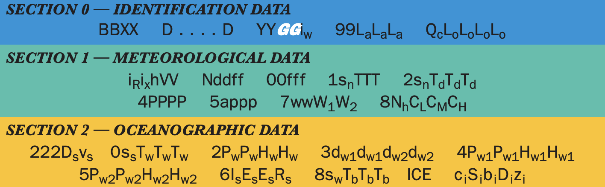
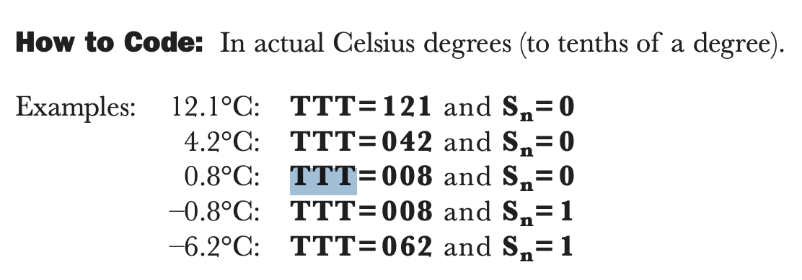

Morse code… or is it?

There is a lookup table provided… but aint nobody got time for that, so ima rely on trusty Cyberchef for general decoding purposes:

- [CyberChef Morse decoder](https://gchq.github.io/CyberChef/#recipe=From_Morse_Code('Space','Forward%20slash')&input=Li0uIC0uLS4gLi4uLSAvIC0uLiAuIC8gLi4tIC0uLS4gLSAuLSAuLi4uLiAvIC4tLS0tIC4uLi0tIC4tLS0tIC0tLS4uIC4tLS0tIC8gLS0tLS4gLS0tLS4gLi4uLS0gLi4uLi0gLi4uLi4gLyAuLS0tLSAtLS0tLSAuLi4tLSAuLi4uLSAtLi4uLiAvIC4uLi4tIC4tLS0tIC0uLi4uIC0tLS0uIC0tLS4uIC8gLi4uLS0gLi4tLS0gLi4uLi0gLS0tLS0gLi4uLi4gLyAuLS0tLSAtLS0tLSAuLi0tLSAtLS0uLiAtLS0tLSAvIC4uLi4tIC0tLS0tIC4tLS0tIC4uLS0tIC0tLS0tIC8gLi4uLi4gLi4uLi0gLS0tLS0gLS0tLS0gLS0tLS0gLyAtLS4uLiAtLS0tLSAuLi0tLSAtLS0tLSAtLS0tLSAvIC0tLS4uIC4uLi0tIC4uLi4uIC0tLS0tIC0tLS0tIC8gLi4tLS0gLi4tLS0gLi4tLS0gLi4uLi4gLi4tLS0gLyAtLS0tLSAtLS0tLSAuLi0tLSAtLS0uLiAtLS0tLSAvIC4tLS0tIC4uLi0tIC0tLS0tIC4tLS0tIC4uLS0tIC8gLS4uLiAtIC8gLi0gLi0uIC8gLi4tIC0uLS4gLSAuLSAuLi4uLiAvIC0u)

It decodes into this… hurmph??? Question mentioned that it is Russian weather report.

```text
RCV DE UCTA5 13181 99345 10346 41698 32405 10280 40120 54000 70200 83500 22252 00280 13012 BT AR UCTA5 N
```

Found a unassuming Facebook post about morse code in Russian : O Which yields something entirely different. The below are sub resources that eventually led me to my final ans.

```text
РЦЖ ДЕ УЦТА5 13181 99345 10346 41698 32405 10280 40120 54000 70200 83500 22252 00280 13012 БТ АР УЦТА5 Н
```

- could potentially be FM13-X ship codes: [FM13-X SHIP code reference](https://www.scribd.com/document/50431931/MEANING-OF-THE-SYMBOLS-IN-THE-FM13-X-SHIP-CODE)
- [FM-13 meteorological observation codes](https://mylittlewordland.com/course/327746/fm-13-meteorological-observation-codes)



Eventually, found a full report detailing the proper format: [NOAA observing handbook](https://vos.noaa.gov/ObsHB-508/ObservingHandbook1_2010_508_compliant.pdf)

- The field of interest is this: `10280` , 6 entries before `22252`
- The starting 1 matches the 1SnTTT format. There ar a lot of other TTT with various subscripts (including dew points and wtv) but I intuition tells me it is the most straight forward answer.

Filling in the blanks, TTT = 280 = 28.0 Celcius

My intuition helped me here, I mean, TTT is likely 1 dp cause temps can’t go beyond 2 digits (else u r roast or an ice lolipop.) However, here is the diagram to help you:



Source: [Bellingcat Challenge 10](https://challenge.bellingcat.com/challenge/10/)
