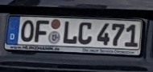
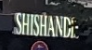

Car plate first things first. There is a blue little box with stars in it, likely EU.

- There is a circular blip in the middle of the car plate, which looking up the EU car plate website, indicates Germany
- [European license plate reference](http://www.worldlicenseplates.com/world/EU_EURO.html)
- I mean, besides the german looking words and abundance of beer… yeah, it is Germany alright.

SHISHAND- something, probably a beer place. Google maps shows that it is SHISHANDIS and there are only 2 stores in Frankfurt. Fantastic.

- **Stiftstraße**
- Found it!

Source: [Bellingcat Challenge 11](https://challenge.bellingcat.com/challenge/11/)
