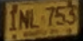
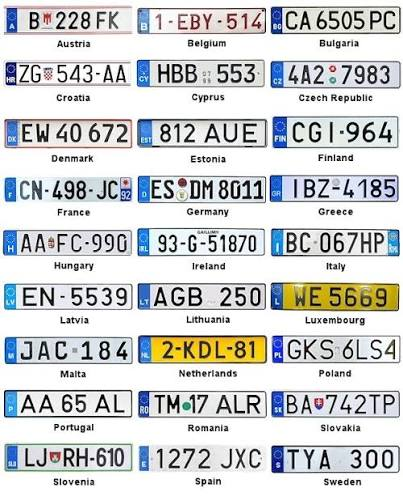
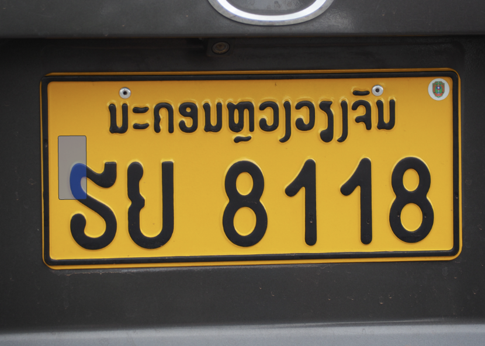
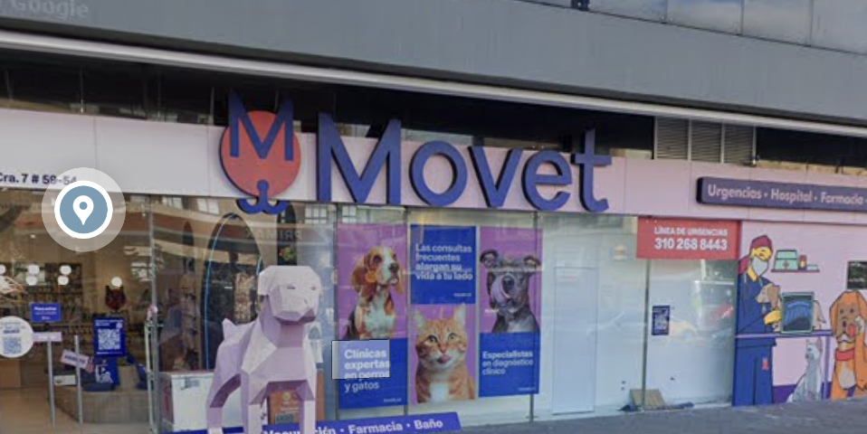

Notice how the car plate is yellow. Retrieve information via carplate.

- eliminate EU: It has no blue EU square at the left

- Elimate Asia: it doesn’t have asian characters (e.g.) Laos

We then match it to Columbia, it has the correct format of XXX 000, with the province name in the bottom:

- [Colombian registration plate guide](https://matriculasdelmundo.com/colombia.html)
- This website is found on the wikipedia page of Columbian car plates.

Based on our picture, there appears to be a space between the province, with the 2nd word being very short. Likely BOGOTA D.C.

We can see an orange petrol station in the distance, which we can retrieve the name of by browsing Google maps for petrol stations: Primax

This is the most difficult part: finding the right Primax.

- I feel like there could be a way where you put a filter for both primax and monuments, but that didn’t really work on Google Earth Pro :/ it seems that there is some issue where earth pro is not updated with the latest info from Google Maps. likely cause it will be decommed soon :( r.i.p.

We found the correct Primax! There is Bancocolombia branch in the distance.

- [Primax Triángulo Autogas on Google Maps](https://www.google.com/maps/place/Primax+Tri%C3%A1ngulo+Autogas/@4.6447323,-74.0636485,480m/data=!3m1!1e3!4m10!1m2!2m1!1sprimax+bogota!3m6!1s0x8e3f9a38efb016af:0x61020e32113a8ec5!8m2!3d4.6447328!4d-74.0616199!15sCg1wcmltYXggYm9nb3RhkgELZ2FzX3N0YXRpb27gAQA!16s%2Fg%2F1tv255ql?entry=ttu&g_ep=EgoyMDI2MDkwOS4wIKXMDSoASAFQAw%3D%3D)
- Perhaps the bank is just an ATM, it doesn’t show on the maps when I initially tried filter on both Bancocolombia and Primax :/
- Another point I missed was: I thought it was Movec instead of Movet. Movet is a pet vet chain in Columbia.

Monument is nearby, zoom out and pan to the correct direction along the road **Avenida 7**

We find our monument: **Julio Flórez**

Yipee

Source: [Bellingcat Challenge 4](https://challenge.bellingcat.com/challenge/4/)
