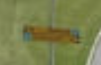
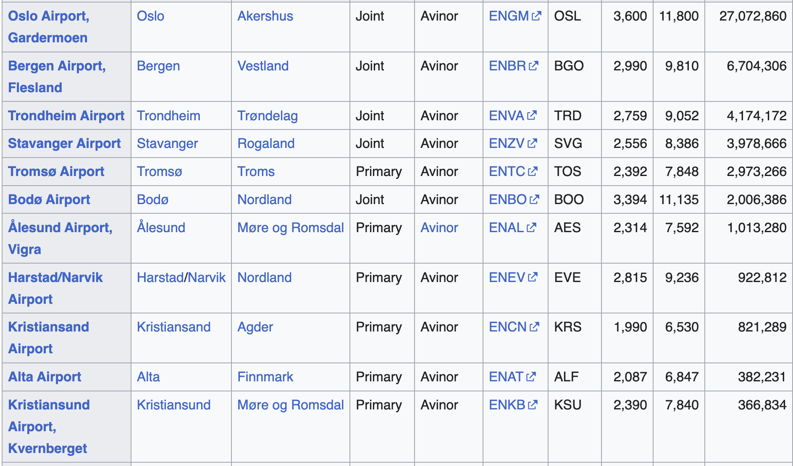
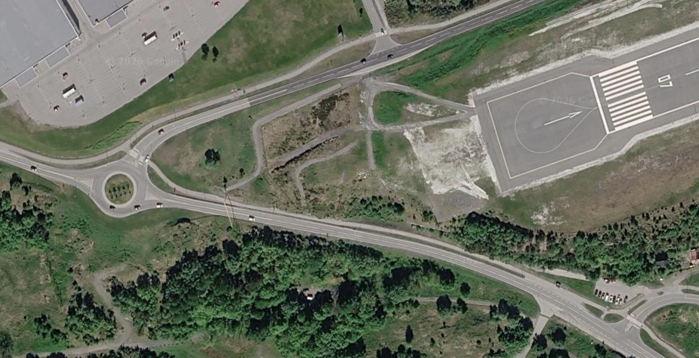
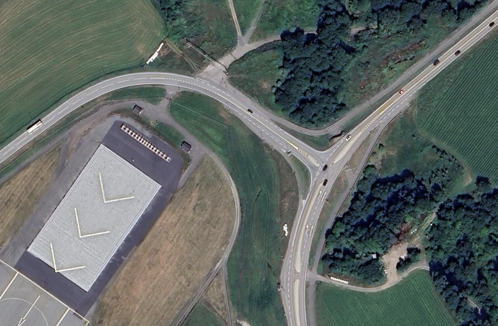

SAS mainly flies in the Nordics, the terrain looks like it too, I miss Scandy :,) Before we get too sappy about good times lost, let us dive into this challenge.

Flight is on a Tuesday, this will be key to solving our challenge.

## Identifying the country

[How to tell Nordic countries apart](https://www.reddit.com/r/geoguessr/comments/n354o5/tell_scandinavian_nordic_countries_apart/). Geoguessr community saves the day

- Give way sign has red borders and white insides, leaving us with half the options: Denmark, Norway, Faroe Islands
- Faroe Islands is too bad for that, my impression is that it is baldy like Iceland
- As to Norway or Denmark, we further observe that the directional signages fits the bill for Norway

Great! We have greatly reduced our scope of search… However, there are still quite a handful of airports around Norway, which one it is? From Google earth Satelite view, I can actually find roads that looks like a T junction, with the most significant identifiers that a lot of roads don’t have being the yellow chevron in the middle.

## Narrowing down the airport

Next, using Frlightradar24 and Flightaware, we can see all the airports we need to examine:

- Out of the whole list, I only picked those with passengers: [List of airports in Norway](https://en.wikipedia.org/wiki/List_of_airports_in_Norway)
- Which actually aligns with the airports you see that has frequent air traffic on the 2 sites above.

While dozing off in bed, I started browsing for landing videos in Norway, with the most notable ones being Oslo and Bergen. Both of them don’t really fit our sunny, hilly, foresty, grassy background that we see.

- Oslo is too near the bay area, minimal tree coverage
- Bergen is too mountainous, whereas the picture had no mountains in the background, just hills. There is also too many Fjords present.

Then, for each item on the list, especially since they are not big airports (e.g.) my point of reference being Gothenburg airport where the landing and departure are always in the same direction (opposites).

- Kristiansund:

- And many more airports that either have no T junction roads near the landing site or is too close to water.

Eventually, I found the airport of interest and the [exact road on Google Earth](https://earth.google.com/web/search/norway+airports/@58.2124191,8.09731032,13.13249288a,521.35886692d,35y,0h,0t,0r/data=CiwiJgokCX0XTXhulU1AEfRAEB8O4UxAGcAggm23ZiVAIaLkgSBUxhZAQgIIAToDCgEwQgIIAEoNCP___________wEQAA)!

- This matches the landing image where this was on the left side of the plane.
- You can also see details that matches the image: the underground tunnel, the yellow chevron, the T junction that curves and has small roads parallel to them.

## Finding the flight

The rest is just finding the SAS flights on Tuesday before sunset.

- [Kristiansand Airport arrivals on Flightradar24](https://www.flightradar24.com/data/airports/krs/arrivals?date=1789565760&page=-1)
- There are only 3 for you to try, which is quite doable.

And we solve the challenge: **SK215**

Source: [Bellingcat Challenge 53](https://challenge.bellingcat.com/challenge/53)
