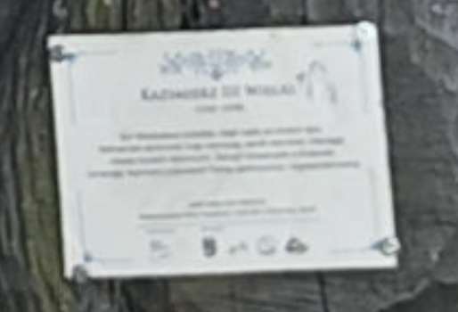
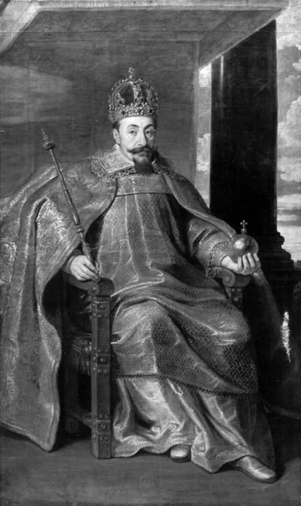
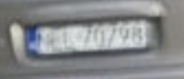
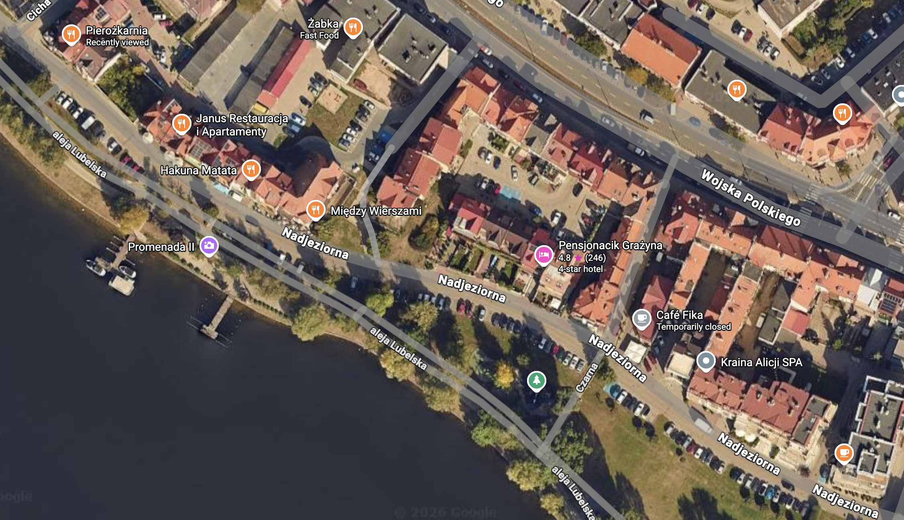

First thing that caught my eye is some sort of greenish hue on the statue itself. It seems to suggest that the statue is not stone/copper, but wood. Doing some googling led me to conclude that it is a wooden statue, a specialty of Poland.

The plaque on the statue as well as the decorations suggest that it is of the King. The wording also fits the Casimir III: Kazimierz III Wielki. This is where I thought I could simply search for the King’s statue and find the location but the statue is not famous enough for that. 

- other details that confirms it is indeed him is the religious symbols, the circular orb he holds.

Hence, we resort to the classic trick, we look at the carplate number first. It is EU for sure, but the formatting matches that of Poland, further confirming our country.

Looking in greater detail, we can determine the exact voivodeship (Polish province) the car is in:

- https://en.wikipedia.org/wiki/Vehicle_registration_plates_of_Poland#:~:text=Polish voivodeship license plate codes. First letter indicates the voivodeship.
- Begins with an N narrows it down by a lot!

Oh hey it is a coastal area near Gdansk! I found this gem of a resource that further narrows our options down by A LOT:

- http://www.authorandbookinfo.com/kingkong/where/pl.htm
- It seems to have letter N followed by 2 letters that have a lower stroke (e.g)
    - NEB: Elblag
    - NEL: Elk

As a tourist, it is likely that the picture is taken downtown, and very likely near a tourist attraction. Using google maps, we search for keywords such as: museum, wood statue:

- We find this park which has a lot of promising wooden statues in that style
- https://www.google.com/maps/place/Promenada/@53.8208118,22.3446625,3a,75y,90t/data=!3m8!1e2!3m6!1sCIHM0ogKEICAgIDblc6bjgE!2e10!3e12!6shttps:%2F%2Flh3.googleusercontent.com%2Fgrass-cs%2FAABkmLch4KQwwiGNA8hDK6iMYUq7M5b_WtlJOOb1s2sKoWGmceb32jYLf99di8__6QLpO2kzuSNwbs_3t3XpJPyb02tMrvE7I2JjDMDdyERAibsLm98sdd93uDJQC6rqjBbd-kIwxT1F1g%3Dw129-h86-k-no!7i2048!8i1365!4m11!1m2!2m1!1swood+statue+elk+poland!3m7!1s0x46e1b97a9d3d112b:0x7008b7c67fd83060!8m2!3d53.8208118!4d22.3446625!10e5!15sChZ3b29kIHN0YXR1ZSBlbGsgcG9sYW5kWhgiFndvb2Qgc3RhdHVlIGVsayBwb2xhbmSSAQtoaWtpbmdfYXJlYZoBJENoZERTVWhOTUc5blMwVkpRMEZuU1VReGF6UnBXbmxSUlJBQuABAPoBBAgAECw!16s%2Fg%2F11fxd_lt67?entry=ttu&g_ep=EgoyMDI2MDkyMy4wIKXMDSoASAFQAw%3D%3D
- Lo and behold we found the exact statue: https://maps.app.goo.gl/MKczTRMhGP7EevUi6

Instead of browsing through the google reviews, I zoomed out the map to find car parks then dropped the google streetview pin and eventually found the location.

Source: https://challenge.bellingcat.com/challenge/78/