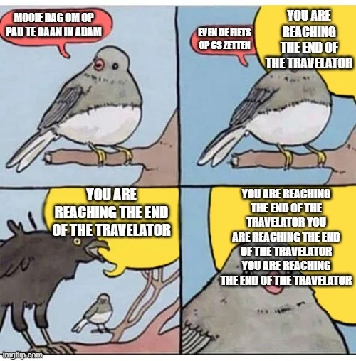
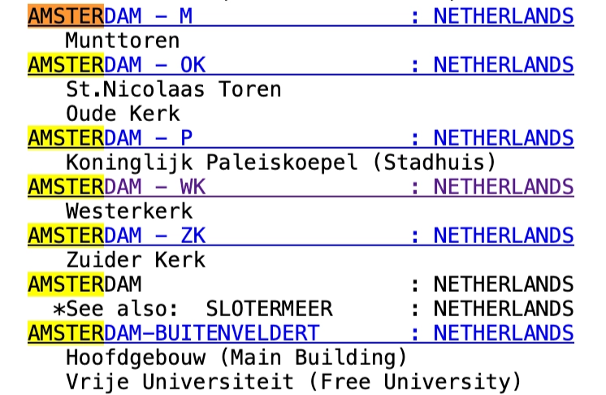

## Picking out the announcements

We begin by listening for the English announcements:

> “Be aware of pickpockets at this station.”

> “Caution, you are reaching the end of the travelator.”

Searching for the first announcement does not yield much. It is simply too broad, and most results are people sharing tips on how not to get pickpocketed.

The second announcement, however, leads us to a Reddit thread:

Amazing Reddit post on r/Amsterdam. One of the comments contains this gem of a clip:

- [Recording of the travelator announcement](https://youtu.be/YoEKZz4KxpM?t=1045)

It is the exact audio we heard. The clip also has tram bell sounds in the background, suggesting that there may be many bicycle parking facilities with similar cautionary announcements.

## Narrowing it down to Amsterdam

Several subtler clues point towards the Netherlands:

- Not many countries have such bustling bicycle traffic. This makes Denmark, Germany, and the Netherlands our prime suspects.
- Bellingcat challenges are typically set in Europe.
- After a button is pressed, we hear the sound of a train door opening. It is characteristic of trains found in these countries.

Once the country is narrowed down, my reasoning for Amsterdam is pretty simple: it is a major city where English announcements would make sense.

There is also a bit of personal heuristic involved. I have been there and vaguely recall hearing that exact announcement at Europaplein station, somewhere outside the central district.

## Identifying the bell tower

The next step is identifying the bell tower. I did not expect to find a recording of the exact chime, but some Googling led me to a fantastic website cataloguing bell towers and chimes throughout the Netherlands:

- [Netherlands carillons and tower bells](http://www.towerbells.org/data/IXNLTRcs.html)

Because the recording has a more traditional carillon sound and the tower must be in Amsterdam, we are left with only a few options:

These recordings sound very similar to the challenge audio. They are in the same key and contain some familiar combinations of notes:

- [Munttoren carillon recording](https://www.youtube.com/shorts/pFMXLdl288s)
- [Another Munttoren carillon recording](https://www.youtube.com/shorts/AVxxyWtnw0s)

We have found the tower: **Munttoren**.

## A long sidetrack

This seems like a pretty straightforward challenge in hindsight, but I was led down many rabbit holes.

My initial hunch was the Netherlands. However, while trying to identify the train jingle just before the pickpocketing announcement, I wandered down a sidetrack trying to identify the exact train. This prompted me to scour more than twenty videos of train, metro, and public-transit jingles, along with door opening and closing sounds.

Nevertheless, I am glad I eventually got back on track with my original hunch. This marks the first audio OSINT challenge I have solved. Pretty interesting, I would say.

Source: [Bellingcat Challenge 81](https://challenge.bellingcat.com/challenge/81/)
