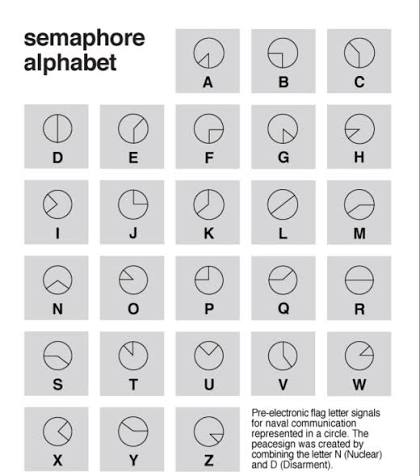

After performing ROT

clubs: zeroes and ones

question mark: face the flags

diamonds: long and short

Hearts: feel the unseen

spades: connect the dots

## Spades

Connect the dots, likely similar puzzle to V4 where you draw the alphabet. But notice that not all the numbers are in Spades, some of the dotted numbers are clubs…

We also notice at cards 9 and 10 has symbols on them, similar to tracing the alphabet to yield

9 G

10 A (star like shape)

| 9s | 5c | 4s | 6s | 10c | 8s | 9c | 5s | 10s |
| --- | --- | --- | --- | --- | --- | --- | --- | --- |
| E (∑ symbol) | x | C | H | A | N | G | E (∑ symbol) | d |

exchanged… ????

6 letters, could be CHANGE?

## Clubs

Zeroes and Ones means that we need to translate the binary in the “CLUBS” from 2 - 10 to numbers.

Zeroes is in gold. Ones is in red.

| 2 | 3 | 4 | 5 | 6 | 7 | 8 | 9 | 10 |
| --- | --- | --- | --- | --- | --- | --- | --- | --- |
| 6 | 5 | 13 | 1 | 12 | 5 | 18 | 1 | 13 |
| f | e | m | a | l | e | r | a | m |

We then notice that it kind of maps to 26 letters, to obtain FEMALE RAM, which is EWE. Just nice, 3 letters!

## Diamonds

Long and Short. We can see morse code on the border of the puzzle.

| … | — — | .— | .—.. | .-.. | …. | — — — | — | . | .—.. |
| --- | --- | --- | --- | --- | --- | --- | --- | --- | --- |
| s | m | a | l | l | h | o | t | e | l |

small hotel is an INN, 3 letters, it fits!

## Hearts

Feel the unseen. All the red cards have this strange strip in the middle that is actually an indication of the order. We follow the order. The unseen is probably alluding to you only looking at the empty shapes.

Braille. Unseen ~ blind. Feel ~ braille. This fits the theme too since we have been dealing with a lot of different ways to represent alphabets.

| 7d | 8h | 10d | 7h | 9d | 10h | 8d | 9h |
| --- | --- | --- | --- | --- | --- | --- | --- |
| n | o | t | e | m | p | t | y |

Not empty is probably FULL or FILL.

## Question Mark

Face the flags. The flags have an angle to them. Could these be clock hands, like the face of a clock? There are 13 possible numbers, if you count the small hands, that makes it 26 letters, corresponding to 26 letters of the alphabet.

| 1 | 2 | 3 | 4 | 5 | 6 | 7 | 8 | 9 | 10 | 11 | 12 |
| --- | --- | --- | --- | --- | --- | --- | --- | --- | --- | --- | --- |
| js | kd | qh | kc | kh | ks | jc | jd | qh | qd | jh | qc |
| 3h 30  | 11h 45 | 3h 30  | 12h 55 | 3h 55 | 12h 45 |  |  |  |  |  |  |
| 3 + 6 | 11 + 9 | 3 + 6 | 12 + 11 | 3 + 11 | 12 + 9 |  |  |  |  |  |  |
|  | weird card, why right hand is ultra long |  |  |  |  |  |  |  |  |  |  |
| f | i | f | t | y | p | e | r | c | e | n | t |

At first I thought right hand is hour, left hand is mins since one hand is shorter than the other. Then, I realised that the flag with the number is the hour hand because card 2, King of Diamonds has a really weird hand. So I tried mimicking the action in real life and realised that the shorter hand (number hand) is actually the hour. 

Upon further digging, there is something called the clock cipher, and a sub variant of it is the semaphore clock cipher, specifically using human hands! This sounds like the closest match. 

Translating it yields the final row: fifty percent. HALF

## Final Password

EWE

HALF

INN

FULL

??? TRADED ???

Speak the final password implies a homophone of sorts (e.g.) EWE = YOU…

I am still unsure of the clue for the final word: EXCHANGED. Looking up synonyms we find:

TRADED, BARTER, SWITCH

Final ans: **You have infiltrated!**
