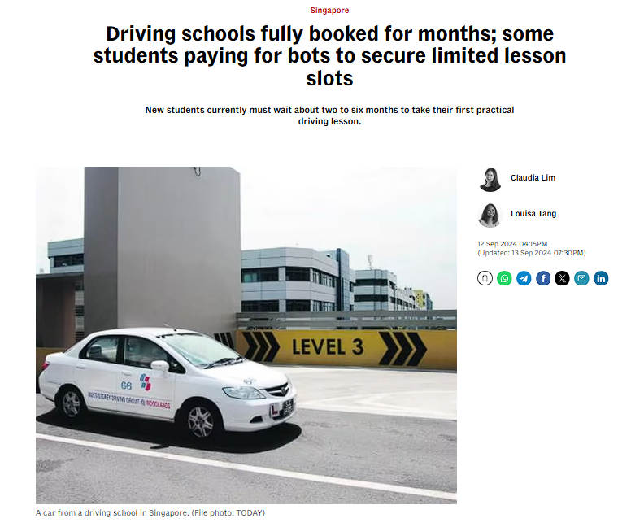
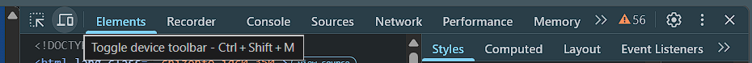
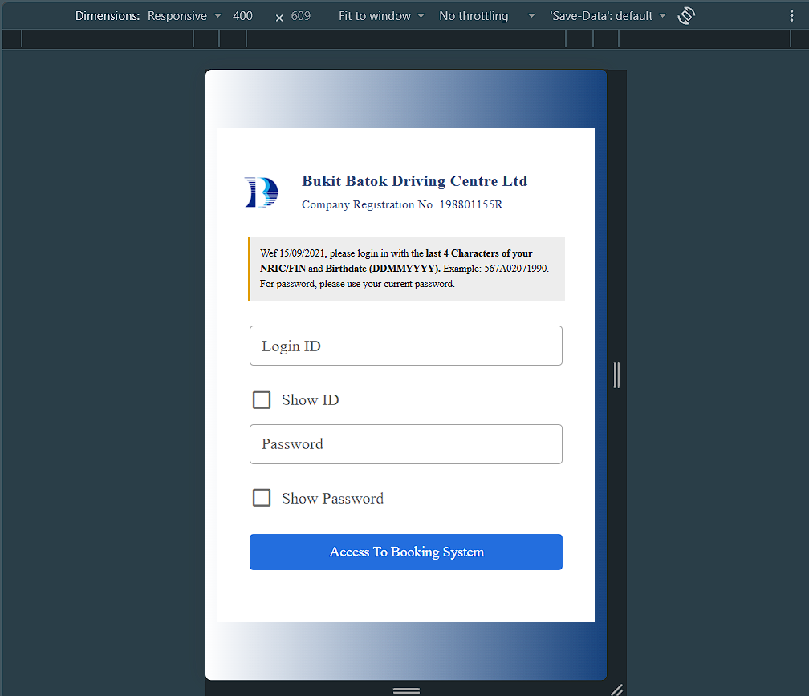
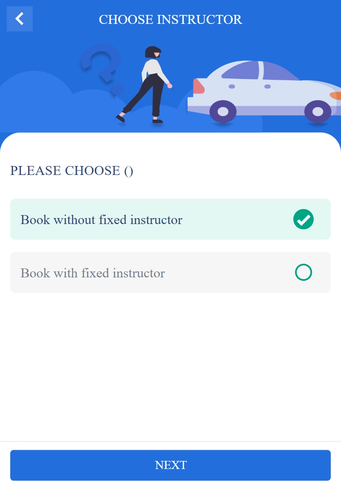
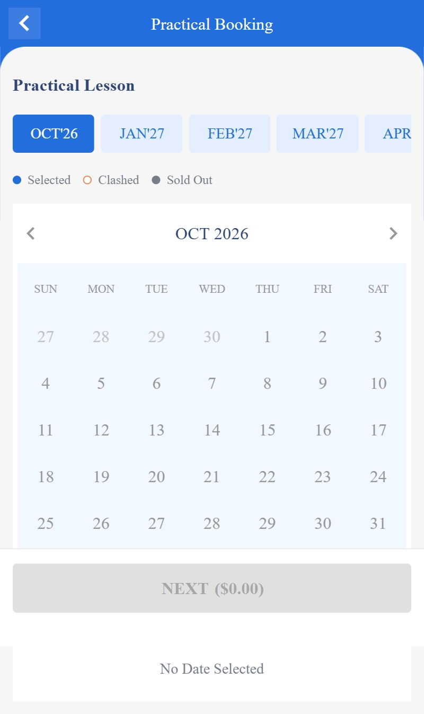

I am sure readers have seen articles like this popping up recently:

Source: [Driving schools fully booked for months; some students paying for bots to secure limited lesson slots](https://www.channelnewsasia.com/singapore/driving-lessons-bots-booking-slots-schools-take-action-4603386)

It has become incredibly difficult to get slots for driving lessons. The biggest problem right now is the existence of bots, which snatch up all the available slots before you do.

But what if I told you there was hope?

Using the method below, I managed to get two slots on the same day. Yes, you heard that right. My driving instructor probably had the same expression as you.

Now, before we get too excited, I did get banned afterwards for 48 hours... Whoops. I went a little overboard.

## Minimum requirements

- **Important:** Make sure you have fewer than three lessons booked within the next seven days. The website will not allow you to book Try Sell slots otherwise.
- **A good, stable connection:** Ideally, use Wi-Fi. Cellular data tends to fluctuate, especially around BBDC.
- **An autoclicker:** There are plenty of free options. You do not need any complex functionality, only the ability to click at fixed intervals. I used GT Auto Clicker from the Microsoft Store.
- **An idle desktop device:** When the autoclicker runs, it takes control of your mouse, making most other work impossible. You will pretty much have to dedicate the device to this task. Go doomscroll or something.

Without further ado, let us get snatching, and try not to get banned.

## Setting it up

### 1. Switch the website to mobile view

Use a stable internet connection on your desktop and open the BBDC website. Right-click the page and open the developer tools. In the upper-left corner of the newly opened panel, you should see the button that toggles the device toolbar:

Once you have enabled it, the website should resemble the view on a phone:

The mobile interface is more constrained than the desktop version, which keeps the relevant buttons in predictable locations for the autoclicker.

### 2. Navigate to the booking page

Log in, navigate to the booking page, select **“Book without fixed instructor,”** and press **“NEXT.”**

What appears next will fall into one of two scenarios.

#### Scenario A: No slots are available

You remain on the same screen, and a small red alert appears to indicate that no slots are available. This is the easier scenario.

Set the autoclicker to an interval of ten seconds. Any faster and you risk getting banned. Position it over the **“NEXT”** button.

When a slot becomes available, the page will change. You can then select today's date and book it.

#### Scenario B: The calendar appears, but no dates are selectable

This scenario is more troublesome for two reasons. First, the refresh rate is much lower. Second, the visual change is less obvious, so you must watch for a date becoming selectable.

Instead of positioning the autoclicker over the **“NEXT”** button, position it over the browser's refresh button:

### 3. Complete the booking

You still need to move quickly and complete the CAPTCHA yourself. You will know you succeeded once the lesson fee has been deducted from your account.

Congrats! You just sniped a slot. Go wild, tiger, and hit some kerbs along the way!

> **Note:** You will need to log in and complete another CAPTCHA approximately every twenty minutes. After that, start the autoclicker again.

## Questions from curious readers

### So... aren't you also using a bot?

Well... what is a bot, anyway?

There are conflicting definitions online, but broadly speaking, a bot performs repetitive tasks without requiring human interaction. Most run autonomously across a network.

I consider my “bot” a very rudimentary one. It is not sniping the slots for me. I am still the one selecting the slot and completing the CAPTCHA.

### Why don't you refresh manually?

Based on my experience, it has not worked particularly well. I spent more than an hour refreshing at irregular intervals. Something about repeatedly pressing a button while staring at a static screen kills me on the inside.
