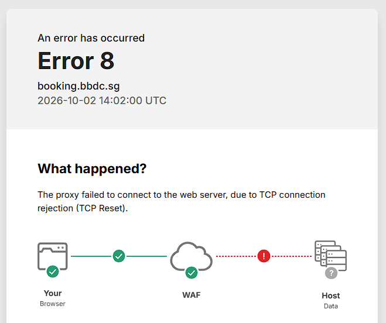

In [Part 1](../speeding-ticket-speedrun-part-1/), I showed how an autoclicker could help snag last-minute driving lesson slots at BBDC. It worked surprisingly well, but it also earned me a 48-hour ban. Whoops.

Naturally, that left me wondering what was actually going on under the hood. 

This is Part 2, where we dive into the rabbit hole of Web Application Firewalls (WAFs) and how modern systems detect automated traffic. As always, any discussion of bypasses here is purely theoretical and educational.

## Why not build a proper bot?

The first question you might ask is: why bother with an autoclicker taking over your whole desktop when you could just write a script to hit the booking API directly?

The short answer is that BBDC has been actively cracking down on bots. Direct API calls are an easy way to raise red flags, especially since parts of the site, including the CAPTCHA and booking flows, sit behind Imperva.

Imperva uses what they call Advanced Bot Protection. Rather than just waiting for someone to spam an endpoint, it evaluates traffic using a mix of behavioural analysis, machine learning, device fingerprinting, and dynamic challenges. 

In other words, you do not need to make an obvious mistake to get flagged. The WAF can piece together multiple tiny signals and decide that your session looks unnatural.

## Fingerprinting: How they know it is you

A WAF can build a profile of your machine before you even click a button, just by looking at data exposed by your browser and network connection.

### Browser and device fingerprinting

Your browser leaks quite a bit of hardware detail:

- WebGL and WebGPU: These expose details about your graphics hardware, including GPU vendor, renderer strings, and supported extensions.
- Canvas fingerprinting: The page asks the browser to draw text or shapes behind the scenes. Tiny differences in operating systems, graphics drivers, and font rendering engines produce slightly different image data, which can then be hashed into a unique ID.
- Font detection: Scripts measure how fallback text renders to infer which specific fonts are installed on your OS.

### TLS fingerprinting: JA3 and JA4

Even if you strip all browser-identifying information, the network connection itself gives you away before any HTTP request is completed.

When your client initiates an HTTPS connection, it sends a `ClientHello` packet. The exact mix and order of cipher suites, extensions, and elliptic curve formats are very characteristic of the software making the call.

- JA3: Gathers the TLS version, accepted ciphers, extensions, and curves into a single string and MD5-hashes it. A raw Python script or `curl` command produces a completely different hash than an actual desktop Chrome browser.
- JA4: A newer standard from the JA4+ suite. It sorts ciphers and extensions so simple reordering cannot trick it, and formats the output into a readable string covering transport protocol, TLS version, cipher counts, and ALPN.

A key thing to keep in mind: clearing your cookies does not reset a fingerprint. Cookies track sessions, but correlation engines combine TLS fingerprints, browser quirks, IP reputation, and timing together.

### Can browser randomisation help?

A common idea to defeat fingerprinting is randomisation. 

Brave, for example, uses a technique called *farbling* (not sponsored, just an interesting implementation). It uses a per-site, per-session seed to introduce tiny, imperceptible pseudo-random noise into canvas rendering, audio signals, and hardware values. This keeps values consistent enough within a single visit so the website works, but varies them across different sites and future sessions.

However, evasion has its own trade-offs:

1. If you randomize too much: Values that constantly change or contradict each other make your browser look even more suspicious.
2. If you standardize too much: Stripping out WebGL or canvas values entirely turns your client into an unusual vanilla outlier.

### What about Playwright?

Why not just use headless browser automation like Playwright or Puppeteer?

Automating an actual browser instance solves part of the problem. You get a real JavaScript runtime, legitimate DOM layout rendering, and normal cookie handling. It is definitely a step up from sending raw `fetch` or `cURL` requests.

Still, "uses a real browser" does not automatically mean "looks human":

- Automated browsers often expose distinct runtime flags (like `navigator.webdriver`).
- Headless Chromium has measurable differences in rendering and feature support compared to headed builds.
- Clean browser profiles lack natural history, cache artifacts, or long-lived cookies.
- Hosted services like Browserless provide infrastructure, but they do not magically make automation signals vanish.

### Testing Browserless with Playwright

Enough theory. How would I actually test this?

Browserless basically lends you a browser running in the cloud, while Playwright tells it what to do. Install `playwright-core`, grab a Browserless token, and pass the token in as an environment variable:

```js
import { chromium } from "playwright-core";

const endpoint = `wss://production-sfo.browserless.io?token=${process.env.BROWSERLESS_TOKEN}`;
const browser = await chromium.connectOverCDP(endpoint);

try {
  const context = browser.contexts()[0];
  const page = await context.newPage();
  const response = await page.goto("https://staging.example.com", {
    waitUntil: "networkidle",
  });

  console.log("Status:", response?.status());
  await page.screenshot({ path: "waf-test.png", fullPage: true });
} finally {
  await browser.close();
}
```

And... that is it. You now have Playwright controlling a remote Chromium browser.

I would start with the most boring version of the script and change only one thing at a time:

- headless browser vs headed browser
- fresh profile vs saved profile
- jumping straight to the target page vs navigating normally
- fixed intervals vs slightly varied intervals
- default settings vs a consistent timezone, locale, viewport, and user agent

Run each version a few times and note whether it gets allowed, challenged, rate-limited, or blocked. If you change five things at once and it suddenly works, that doesn't exactly help you a lot. This goes back to the basics of writing unit tests for dev work.

You can also compare the browser against a raw HTTP client, repeat the same flow from an approved datacentre IP, and check whether the rate limit follows the account, session, or IP address. Chances are, datacentre IPs won't work.

Obviously, point this at a staging site or something you have permission to test. *Coughs aggressively.* 

## Dynamic challenges

When a WAF is not entirely sure whether you are human, it throws up friction to verify your session:

- Cookie challenges: Tests whether the client can persist and return state across redirects. This weeds out simple stateless scripts.
- JavaScript challenges: Runs a background script that must execute and return a valid result. An ordinary browser handles this instantly, while primitive HTTP clients choke.
- CAPTCHAs: The ultimate roadblock. Imperva claims legitimate users are served a CAPTCHA on less than 0.001% of requests (take that claim with a grain of salt, but that is their figure).

Once you trigger an active challenge, trying to solve it programmatically is an uphill battle. The real takeaway is that if you are constantly hitting challenges, the issue started earlier with your request rate, session headers, or connection behaviour.

## Behavioural monitoring and IP reputation

Even with a realistic browser and TLS handshake, how you behave still matters:

- Timing: Automated scripts often poll at exact intervals. Adding a basic random delay helps, but naive uniform randomness can still look artificial compared to actual human browsing intervals.
- Request flow: Jumping directly to checkout/booking endpoints without loading the preceding assets or referrer pages is an immediate giveaway.
- IP reputation: Datacentre IPs (AWS, DigitalOcean, etc.) are heavily penalised by bot managers. Residential proxies look closer to normal home connections, but they can be slow, costly, and frequently share dirty reputation histories from prior abuse.

## Did Imperva actually catch me?

Which brings us back to my 48-hour ban: did Imperva's bot protection actively catch my autoclicker setup?

While testing, I ran into this screen:



At first glance, I assumed the WAF had flagged and blocked my session. 

Looking closer at the error details, though, the proxy was simply failing to connect to BBDC's origin server due to a `TCP connection reset`. It indicates that the backend server dropped the connection rather than the WAF serving an intentional bot block. 

The timing was definitely suspicious, but the honest verdict? Inconclusive. :O

## Sources

- [Imperva: Advanced Bot Protection](https://www.imperva.com/products/advanced-bot-protection-management/)
- [Imperva: What are bots?](https://www.imperva.com/learn/application-security/what-are-bots/)
- [Salesforce: JA3 TLS fingerprinting](https://github.com/salesforce/ja3)
- [FoxIO: JA4+ fingerprinting](https://github.com/FoxIO-LLC/ja4)
- [Brave: Fingerprint randomisation](https://brave.com/privacy-updates/3-fingerprint-randomization/)
- [Brave: Fingerprinting defenses 2.0](https://brave.com/privacy-updates/4-fingerprinting-defenses-2.0/)
- [FPRandom: Randomizing core browser objects to break advanced device fingerprinting techniques](https://inria.hal.science/hal-01527580/document)
- [Playwright: Browsers](https://playwright.dev/docs/browsers)
- [Browserless: Connect Playwright](https://docs.browserless.io/overview/getting-started/connect-playwright)
