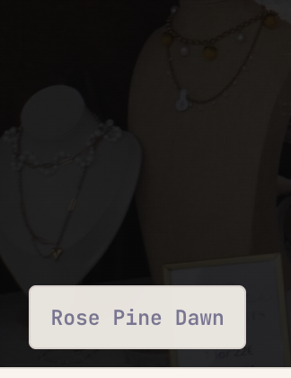
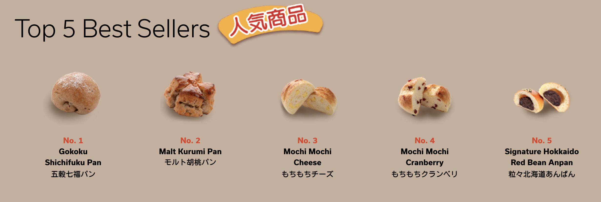
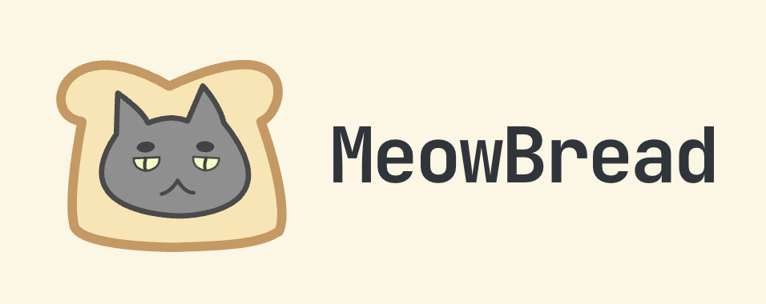
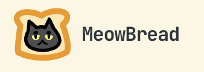

The following are some of the ideas I want to achieve:
* showcase my art skills
* make it bakery themed: I love bread, after all!
* cats too... if possible :D maybe like a cat mouse icon?

Flavour: Pick your flavour of bread. 
Have flavour as the text, and "select your flavour of noms" arrow that follows the webpage, encouraging users to pick a flavour.

* blueberry nice: white base with purple
* starberry shortcircuit: light pink base and brown.
* spujcpz: off white (almost buttery colour) base, brown. Basically a notebook theme
* matcha munch: off white (light green) base with matcha green
* sesame sweet: replaces your typical dark theme. Grey base.
* toxic waste: black and green, like h4ck3r terminal.

Icons:
* cats and bread!

img from Gokuku
* Having bread icons seems rlly cute
* website icon and MeowBread icon should be a cat's head stuck inside toast

Made some progress!

The bread is catting :3

New logo is out! I realised that the original Astro favicon icon has thick, defined lines that allows the icon to be visible even from a distance... With that, I layered over everything, still using svg... and after an hour of toil, new logo is up!

